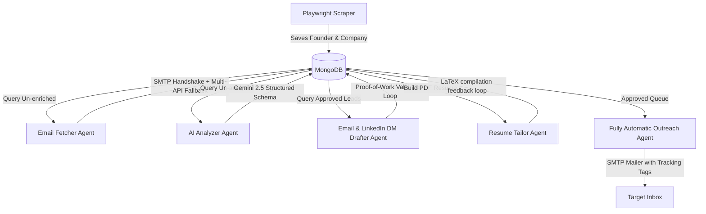

# ⚡ ZapplyX - Asynchronous Multi-Agent Outreach Automation Platform

Live Site: [https://www.zapplyx.com](https://www.zapplyx.com)  
*Proprietary Software: Refer to the LICENSE file for confidentiality and licensing terms.*

ZapplyX is a highly optimized, multi-agent enterprise job hunt pipeline and outreach orchestration engine. It autonomously crawls startup directories, extracts unstructured company data, discovers and validates direct email addresses using custom SMTP handshakes and API fallbacks, generates deep technical system analyses using LLMs, builds tailor-made single-page LaTeX resumes, and automates tracking-friendly email/LinkedIn campaigns.

The platform is paired with a premium, self-contained **Glassmorphism Single-Page Dashboard** interface featuring real-time logging, batch execution runners, template customizers, and Excel report generators.

---

## 🏗️ Technical & Backend Architecture

The backend is built as a production-grade asynchronous Python server, engineered to handle intensive data extraction, third-party API integration, dynamic PDF compilation, and high-volume email workflows.



### 1. Asynchronous FastAPI & Event-Loop Observability
* **Asynchronous Execution Model**: Built entirely on top of FastAPI, leveraging asynchronous routes (`async/await`) and non-blocking I/O throughout the execution paths.
* **Global Real-Time Log Buffering**: Incorporates a thread-safe circular deque (`log_buffer = collections.deque(maxlen=500)`) via a custom `InMemoryLogHandler`. This captures all logs from the root logger, the agent system, and the routing pipeline, exposing them instantly via the `/api/pipeline/logs` endpoint for the dashboard log visualizer.
* **Active Task Registry**: Tracks background execution states dynamically inside a thread-safe state dictionary (`active_tasks`), reporting real-time progress statistics (processed vs. total counts and custom message streams) for all pipeline operations (scraping, enrichment, analysis, outreach drafting, resume tailoring, and email dispatch).

### 2. Robust MongoDB Persistence Layer (Async Motor Client)
* **Loop-Aware Client Registry**: Implements a registry mapping event loops to databases (`_loop_databases`) to guarantee compatibility across different asynchronous thread loops (preventing event-loop conflicts on Windows platforms where background processes run on different event loops).
* **Sparse & Unique Index Optimization**:
  * Enforces unique constraint indexes on `founder_id` and compound keys on `(name, company)` to ensure data integrity during multiple crawls.
  * Employs sparse unique indexes on `linkedin_url` (allowing documents with null social links to avoid duplicate-null collisions) and a non-unique index on `yc_url` since multiple founders can share a single company profile.
* **Schema Integrity**: Uses robust Pydantic models (`Founder`, `CompanyData`, `EnrichmentData`, `IntelligenceData`, `PipelineStatus`, `ArtifactsData`) to validate document structures and types on read/write boundaries.

### 3. High-Concurrency Task Throttling
*   **Semaphore-Bounded Concurrency**: Throttles intensive processing batches using `asyncio.Semaphore(5)` locks. This limits concurrent requests during API enrichment, LLM generation, and LaTeX compilation to protect database memory and prevent rate-limiting/IP-bans from API providers.
*   **Jittered SMTP Session Pooling**: Rather than creating a separate SMTP TLS connection for every message in a batch, the `Fully Automatic Outreach` agent opens a single pooled SMTP session, dispatches emails sequentially, and injects a randomized delay jitter (3.0 to 5.0 seconds) between emails to mimic human behavior and avoid spam filters.

### 4. Distributed Asynchronous Task Queue (Celery + Redis)
*   **Decoupled Worker Model**: Shunts all high-workload operations (e.g. Playwright crawls, LLM matching, LaTeX compiling, and batch mail dispatches) from local FastAPI thread execution to isolated Celery worker processes, using Redis as the task broker and result store.
*   **Windows Multiprocessing Compatibility**: Runs worker tasks using the single-threaded `solo` concurrency pool, bypassing the Windows system `fork()` limitation.
*   **Fair Prefetch Throttling**: Tuned to a prefetch multiplier of 1 (`worker_prefetch_multiplier=1`) to prevent task-starvation and load-balance batch executions equally.
*   **Task-Level Retry Policies**: Implements automated linear retry policies with custom backoffs (`10 * (retries + 1)` seconds) up to 3 times for API rate-limits and network dropouts.
*   **Redis State Boundaries**: Implements a self-healing error handler. If a background worker task fails permanently, it intercepts the exception and updates the task status in Redis (`active_tasks:{user_id}`) to `"idle"` with the failure details, keeping the UI dashboard synchronized.

### 5. Unified JSON Observability & Prometheus Metrics
*   **Structured Logging**: Configured standard loggers to format stdout/stderr streams to a unified JSON record containing `"timestamp"`, `"level"`, `"logger"`, `"message"`, and `"correlation_id"`.
*   **Correlation ID Thread-Safety**: Employs contextvars to propagate unique request Correlation IDs from incoming FastAPI middleware down through Celery workers and background tasks for absolute E2E traceability.
*   **Prometheus Metrics Sub-App**: Mounted an ASGI Prometheus client on `/metrics/` measuring HTTP request durations, endpoint counts, and worker processing latency histograms.

---

## 🤖 Multi-Agent Orchestration Blueprint

The core functionality is split across six specialized, autonomous agents that orchestrate the pipeline from discovery to dispatch:

### 1. Playwright Scraper Agent (`ScraperAgent`)
* **Anti-Bot Evacuation & Evasion**:
  * Randomizes user-agent strings (headers) and screen viewport boundaries.
  * Injects startup scripts disabling the `navigator.webdriver` automation flag.
  * Simulates human interactions through randomized scroll jitters.
* **Data Extraction**: Extracts clean company metadata (website, industry, sector, location, founded year, team size) and grabs individual founder cards (name, role, LinkedIn, Twitter, biography).
* **Founder Q&A Crawling**: Locates and parses Q&A panels, appending them to company descriptions to enrich LLM contexts.
* **Zombie-Loop Prevention**: Automatically propagates scraped company data to other co-founders of the same company, preventing repetitive scraping loops.

### 2. Email Fetcher Agent (`EnrichmentAgent`)
* **Dynamic Permutation Formulation**: Generates standard business email patterns (`first@company.com`, `first.last@company.com`, `f.last@company.com`, etc.). It reduces the confidence score of simpler patterns (e.g. `first@domain`) as the target company's team size increases to minimize false positives.
* **Tarpit-Proof Local SMTP Handshake**: Resolves MX records via DNS. Connects directly to the target mail servers and executes a verification handshake:
  1. Issues `HELO`/`EHLO` and upgrades to `STARTTLS` if supported.
  2. Submits `MAIL FROM` using a verification address.
  3. Sends `RCPT TO` for permutations sequentially, checking for acceptance code `250`.
* **Catch-All Heuristics**: Sends a dummy request with a random string address. If accepted, the domain is flagged as a catch-all. In this case, local SMTP checks are bypassed, and the agent falls back to weight priorities to prevent false positives.
* **6-Stage API Fallback Rotation**: If local SMTP verification fails, the agent rotates through multiple API providers:
  1. **Explorium API**: Calls Match and Enrich endpoints.
  2. **Apollo.io API**: Implements a rotation of up to **5 API keys**. It queries CRM contacts; if not found, it creates a contact in the CRM to trigger Apollo's auto-enrichment, waits 3 seconds, and queries the contact details again.
  3. **Lusha V3 Search & Enrich API**.
  4. **Hunter.io API**.
  5. **Tomba.io API**.
  6. **Prospeo.io API**.

### 3. AI Analyzer Agent (`IntelligenceAgent`)
* **Semantic Vector Profiling**: Matches the target company’s domain against the candidate's profile (`candidate_profile.json`), highlighting relevant projects.
* **Pydantic-Constrained Structured Output**: Uses the modern Google GenAI Client (`gemini-2.5-flash`) to generate structured JSON matching the `IntelligenceData` Pydantic schema:
  * Classifies the company into exactly one domain (`infra`, `agents`, `fintech`, `search`, `ml_pipelines`).
  * Formulates a 12-word core bottleneck statement and identifies specific scaling challenges.
  * Implements constraint routing: for `infra` companies, it strictly focuses on throughput, latency, FLOP utilization, and memory interconnects.
* **Failsafe OpenAI Fallback**: If Gemini hits quota limits or rate limits, the agent automatically falls back to OpenAI's `gpt-4o-mini` with exponential-backoff retries.

### 4. Email & LinkedIn DM Drafter Agent (`OutreachAgent`)
* **The Validator Loop (Rejection Filter)**: To prevent generic, AI-sounding copy, this agent runs generated drafts through a strict multi-point check, rejecting and regenerating drafts (up to 3 times at varying temperatures) if they fail any of the following rules:
  * **Subject Singularity**: The subject line must be exactly `[system noun] + [failure mode]` (2-3 words, lowercase, no punctuation, no verbs, e.g. `state desync`, `transaction mismatch`). It rejects plural words (except technical terms like `data` or `routing`).
  * **No Plural Subjects**: Subject line nouns must be singular.
  * **No Generic References**: Rejects generic placeholders like "your system".
  * **Specific Nouns**: The hook paragraph must reference specific system nouns (e.g. `data flow`, `inference pipeline`, `memory transfer`).
  * **No Weak Hook Endings**: Rejects sentences ending with generic statements like "is hard" or "is challenging".
  * **Single Mechanism Focus**: Ensures only **one** allowed mechanism is mentioned (e.g. `checkpoints`, `validation`, `routing`) to keep the email concise and focused.
  * **Context Verification**: Prevents hallucinating constraints (e.g. "on-device", "real-time", "noisy inputs") unless they are present in the company's description.
  * **Length Limits**: Enforces a strict length limit of **30 to 90 words**.
* **4-Paragraph Formatter**: Automatically formats the validated text into a clean 4-paragraph layout: greeting, target hook, candidate experience mapping, and a call-to-action.

### 5. Resume Tailor Agent (`ResumeTailorAgent`)
* **Tailored LaTeX Compiler**: Parses a base LaTeX resume (`resume_template.tex`) and tailors experience bullet points to match the target company's engineering pain points without fabricating facts or credentials.
* **Layout Spacing Optimization Loop**:
  To guarantee that the tailored resume fits on **exactly one page**, the agent implements a multi-pass compilation loop:
  1. Compiles the LaTeX code asynchronously inside a unique sandbox folder using `pdflatex` or `tectonic`.
  2. Inspects the page count of the generated PDF using `pypdf`.
  3. Iterates through 5 predefined layout spacing profiles (Expanded, Standard, Semi-Compact, Compact, Extremely Compact) until the document fits on exactly one page.
  4. If the document still exceeds one page, it prompts Gemini to rewrite the bullet points 30% more concisely, then repeats the layout search.
  5. As a final fallback, it compiles the shorter text using the "Extremely Compact" profile.
* **Base64 Caching**: Encodes the compiled PDF into a Base64 string and caches it in MongoDB for instant download.

### 6. Fully Automatic Outreach Agent (`OutreachSenderAgent`)
* **MIME Construction**: Builds plain-text emails (`MIMEText` with UTF-8 encoding).
* **Analytics Tagging**: Injects custom tracker headers (e.g. `X-Mailin-Tag` with the lead's `founder_id`) to map open and click rates in services like Brevo.
* **Error Log Persistence**: Catches SMTP connection errors and saves details directly to the database card (`artifacts.email_error_log`).

---

## 🎨 Interactive Glassmorphism Dashboard

The dashboard provides a premium, responsive user interface built using vanilla CSS variables, glassmorphism design, and Plus Jakarta Sans typography.

| Dashboard Section | Core Capabilities |
| :--- | :--- |
| **KPI Counters** | Real-time counts of scraped, enriched, analyzed, approved, resume-generated, email-sent, and replied leads. Includes hover glowing borders and color-matched metrics. |
| **Active Tasks Monitor** | Displays status (running vs. idle), progress bars, and execution messages for each agent. |
| **Founders Data Table** | Displays leads with pagination and filters (by batch, scraping status, social links, verified emails). Includes inline status indicators. |
| **Lead Inspector Pane** | A sticky sidebar panel that opens when a row is clicked, showing company descriptions, social handles, and contact details. |
| **Interactive Editor** | Allows users to edit email subjects, email bodies, and LinkedIn DMs directly, with quick-action buttons for manual approval or rejection. |
| **Operations Control Panel** | Triggers batch processes (scraping, enrichment, analysis, outreach generation, resume tailoring, and email dispatch) with custom size limits. |
| **Logs Console** | Displays the latest 100 lines of agent execution logs with real-time autoscrolling. |
| **Resume Uploader & Parser** | Uploads a PDF resume, extracts text and hyperlinks, parses skills and experiences via Gemini, and updates `candidate_profile.json` dynamically. |
| **Template Customizer** | View and edit base LaTeX templates and candidate profiles inside raw text editors. |
| **Excel Export Tool** | Streams the filtered database view as a `.xlsx` spreadsheet download. |

---

## ⚙️ Configuration & Environment Setup

Configure the application by creating a `.env` file in the `backend/` directory:

```env
# MongoDB Connection Configs
MONGODB_URI=mongodb://localhost:27017
MONGODB_DB_NAME=jobhunt

# Task Queue (Redis Broker)
REDIS_URL=redis://localhost:6379

# Server Port and Host
HOST=127.0.0.1
PORT=8001
DEBUG=true

# LLM Keys
GEMINI_API_KEY=AIzaSyB...
OPENAI_API_KEY=sk-proj-...

# Contact Discovery API Credentials
EXPLORIUM_API_KEY=2524823...
lusha_api=5275157d...
apollo_api_1=w_-Z8kzC...
apollo_api_2=UmpI6JM...
apollo_api_3=TsRd9Ob...
apollo_api_4=q8xp1C-...
apollo_api_5=a3CgZH...

# Email Campaign Sender Configuration (SMTP)
SMTP_HOST=smtp.gmail.com
SMTP_PORT=587
SMTP_USERNAME=your_username@gmail.com
SMTP_PASSWORD=your_app_password
SMTP_SENDER=your_username@gmail.com

# FastAPI Security Token
API_KEY_SECRET=local-dev-token-default
```

---

## 🚀 Production Deployment Procedures

### Method 1: Docker Compose (Recommended)
This approach launches MongoDB, Redis Broker, the Uvicorn FastAPI Server, and all four Celery Task-specific workers inside isolated, auto-restarting Docker containers.

1. **Verify Prerequisites**: Install `docker` and `docker-compose` on the host machine.
2. **Setup Configurations**: Ensure `backend/.env` is fully populated with production keys.
3. **Build & Launch Containers**:
   ```bash
   docker-compose up --build -d
   ```
4. **Inspect Container Status**:
   ```bash
   docker-compose ps
   ```
5. **Monitor Logs**:
   ```bash
   docker-compose logs -f web
   docker-compose logs -f worker_agents
   ```

---

### Method 2: Manual Systemd Deployment (Ubuntu/Debian)
For native performance on physical or virtual private servers (e.g. AWS EC2, DigitalOcean), run the services using virtual environments managed by `systemd`.

#### 1. System Dependencies Installation
```bash
sudo apt-get update && sudo apt-get install -y \
    curl gnupg build-essential python3-pip python3-venv \
    mongodb-org redis-server texlive-latex-base \
    texlive-latex-recommended texlive-latex-extra \
    texlive-fonts-recommended latexmk
```

#### 2. Virtualenv & Playwright Setup
```bash
cd /opt/zapplyx
python3 -m venv .venv
source .venv/bin/activate
pip install -r backend/requirements.txt
playwright install chromium --with-deps
```

#### 3. Systemd Service Configurations

##### A. FastAPI Web Application: `/etc/systemd/system/zapplyx-web.service`
```ini
[Unit]
Description=ZapplyX FastAPI Web Server
After=network.target mongodb.service redis-server.service

[Service]
User=www-data
WorkingDirectory=/opt/zapplyx
Environment="PYTHONPATH=backend"
EnvironmentFile=/opt/zapplyx/backend/.env
ExecStart=/opt/zapplyx/.venv/bin/python backend/app/main.py
Restart=always

[Install]
WantedBy=multi-user.target
```

##### B. Celery Agents Worker: `/etc/systemd/system/zapplyx-worker-agents.service`
```ini
[Unit]
Description=ZapplyX Celery Agents Worker
After=network.target redis-server.service

[Service]
User=www-data
WorkingDirectory=/opt/zapplyx
Environment="PYTHONPATH=backend"
EnvironmentFile=/opt/zapplyx/backend/.env
ExecStart=/opt/zapplyx/.venv/bin/celery -A app.workers.queue worker --loglevel=info -Q agents --pool=solo
Restart=always

[Install]
WantedBy=multi-user.target
```
*(Create similar systemd service profiles for the other three task queues: `scraping`, `outreach`, and default `celery`.)*

#### 4. Enable and Start Services
```bash
sudo systemctl daemon-reload
sudo systemctl enable zapplyx-web.service zapplyx-worker-agents.service
sudo systemctl start zapplyx-web.service zapplyx-worker-agents.service
```

---

### 🛡️ Nginx Reverse Proxy & SSL (HTTPS)
Use Nginx to handle SSL termination and route requests to the FastAPI application (listening on port `8001`).

1. **Install Nginx**:
   ```bash
   sudo apt install nginx certbot python3-certbot-nginx
   ```
2. **Configure Nginx Site**: Create `/etc/nginx/sites-available/zapplyx.conf`:
   ```nginx
   server {
       listen 80;
       server_name yourdomain.com;

       location / {
           proxy_pass http://127.0.0.1:8001;
           proxy_set_header Host $host;
           proxy_set_header X-Real-IP $remote_addr;
           proxy_set_header X-Forwarded-For $proxy_add_x_forwarded_for;
           proxy_set_header X-Forwarded-Proto $scheme;
           proxy_buffering off;
       }
   }
   ```
3. **Enable Site & Generate Certificates**:
   ```bash
   sudo ln -s /etc/nginx/sites-available/zapplyx.conf /etc/nginx/sites-enabled/
   sudo nginx -t && sudo systemctl restart nginx
   sudo certbot --nginx -d yourdomain.com
   ```

---

## 📦 Directory Structure

```text
├── backend
│   ├── app
│   │   ├── agents
│   │   │   ├── base.py              # Base Agent layout class
│   │   │   ├── scraper.py           # Playwright scraper crawler
│   │   │   ├── enrichment.py        # SMTP email fetcher + 6 API fallbacks
│   │   │   ├── intelligence.py      # AI Analyzer value prop & bottleneck generator
│   │   │   ├── outreach.py          # Personalizer email & LinkedIn copywriter
│   │   │   ├── outreach_sender.py   # Fully Automatic Outreach SMTP sender
│   │   │   └── resume_tailor.py     # Resume Tailor LaTeX parser & compiler
│   │   ├── core                     # Core system modules
│   │   │   ├── telemetry.py         # Request context Correlation ID middleware
│   │   │   ├── logging.py           # Standardized JSON stdout formatter
│   │   │   ├── metrics.py           # Prometheus performance instrumentation
│   │   │   └── redis.py             # Shared state & console log managers
│   │   ├── workers                  # Celery worker application
│   │   │   ├── queue.py             # Broker client & prefetch configuration
│   │   │   └── tasks.py             # Bound worker task error boundaries
│   │   ├── models
│   │   │   └── founder.py           # Pydantic schema document models
│   │   ├── routers
│   │   │   └── pipeline.py          # FastAPI route endpoint controllers
│   │   ├── static
│   │   │   └── index.html           # HTML5 UI dashboard layout
│   │   ├── config.py                # Pydantic configuration loader
│   │   ├── database.py              # Async Motor driver and loop map
│   │   └── main.py                  # API entry point & lifespan init
│   ├── config
│   │   ├── candidate_profile.json   # Synced user profile configuration
│   │   ├── resume_template.tex      # Base LaTeX resume template
│   │   └── selectors.json           # Externalized scraper HTML selectors
│   ├── requirements.txt             # Python packages manifest list
│   └── .env                         # Local environment configs
```
